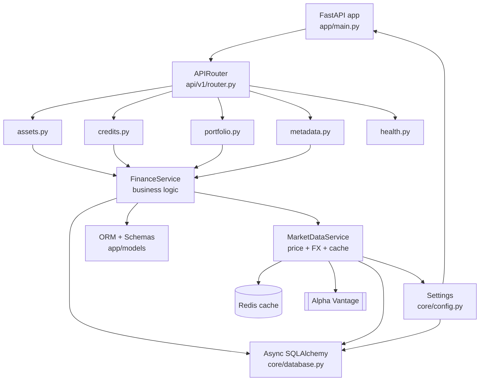
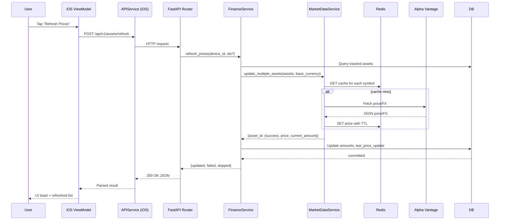
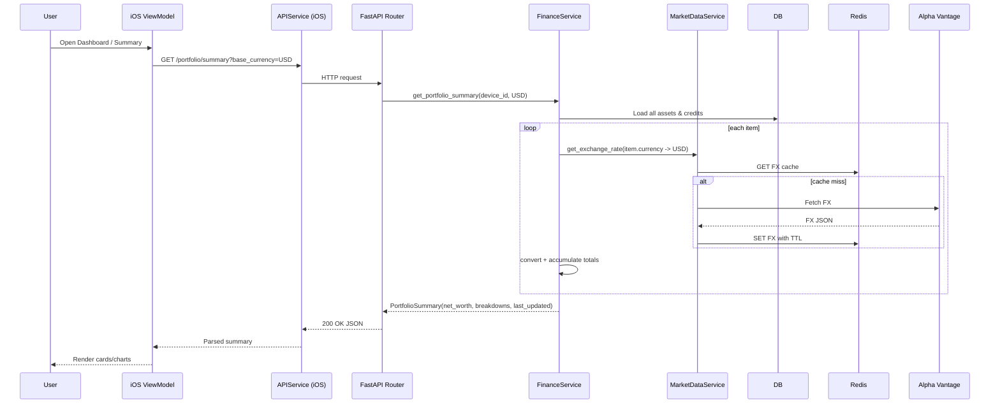

## MoneyInOne Architecture

### System overview

```mermaid
flowchart LR
    subgraph iOS_App[MoneyInOne iOS App (SwiftUI)]
        VM[ViewModels]
        V[Views]
        APIClient[APIService.swift]
        V --> VM --> APIClient
    end

    subgraph Backend[FastAPI Backend]
        App[FastAPI app (app/main.py)]
        Router[v1 Router (api/v1/router.py)\n- assets\n- credits\n- portfolio\n- metadata\n- health]
        Services[Services Layer\n- FinanceService\n- MarketDataService]
        Core[Core\n- config.py (Settings)\n- database.py (Async SQLAlchemy)]
        Models[Models\n- user, asset, asset_type\n- credit, credit_type\n- Pydantic schemas]
        App --> Router --> Services
        App --> Core
        Services --> Models
        Services --> Core
    end

    subgraph Data_Infra[Data & Infra]
        DB[(SQLite/PostgreSQL)]
        Cache[(Redis)]
        ExtAPI[[Alpha Vantage API]]
        Docker[(docker-compose)]
        Core --> DB
        MarketDataService[MarketDataService] --> Cache
        MarketDataService --> ExtAPI
    end

    iOS_App <-- HTTP/JSON --> Backend
    Backend <-- SQL/Async --> DB
    Backend <-- TCP --> Cache
    Docker --- Backend
    Docker --- Cache
```

### Backend component view



### App workflows

#### High‑level user workflow

```mermaid
flowchart TD
    A[App Launch] --> B[Health check /api/v1/health]
    B --> C[Load metadata /api/v1/metadata: currencies, categories]
    C --> D[Fetch lists: /assets, /credits]
    D --> E[Render Dashboard]

    E -->|Add Asset| F[Open Add Form]
    F --> G[POST /api/v1/assets]
    G --> H[Persist via FinanceService -> DB]
    H --> I[Reload lists -> Update UI]

    E -->|Edit/Delete| J[PUT/DELETE /api/v1/assets/{id}]
    J --> H

    E -->|Refresh Prices| K[POST /api/v1/assets/refresh]
    K --> L[FinanceService -> MarketDataService]
    L --> M[Redis cache hit?]
    M -->|Yes| N[Use cached prices]
    M -->|No| O[Call Alpha Vantage]
    O --> P[Cache prices in Redis]
    N --> Q[Update current amounts in DB]
    P --> Q
    Q --> I

    E -->|Portfolio Summary| R[GET /api/v1/portfolio/summary?base_currency=USD]
    R --> S[FinanceService loads assets/credits]
    S --> T[Convert with FX via MarketDataService (cache/API)]
    T --> U[Compute totals & net worth]
    U --> V[Return summary -> UI cards/charts]
```

#### Request/response sequence: Refresh Prices



#### Request/response sequence: Portfolio Summary




